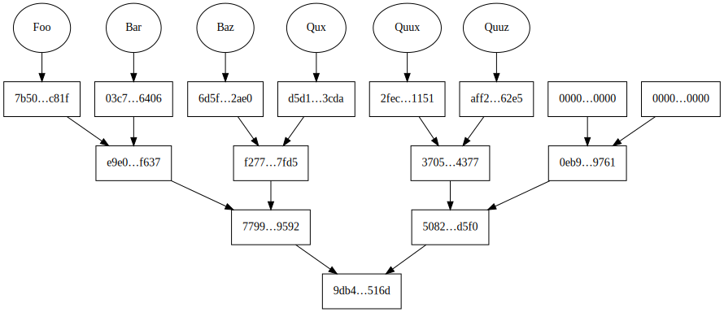
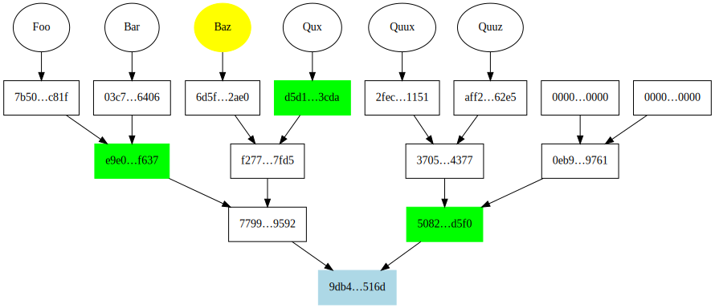

# go-merkletree

[](https://github.com/wealdtech/go-merkletree/releases/)
[](LICENSE)
[](https://godoc.org/github.com/wealdtech/go-merkletree)
[](https://travis-ci.org/wealdtech/go-merkletree)
[](https://codecov.io/github/wealdtech/go-merkletree)
[](https://goreportcard.com/report/github.com/wealdtech/go-merkletree)

Go implementation of a Merkle tree.


## Table of Contents

- [Install](#install)
- [Usage](#usage)
- [Maintainers](#maintainers)
- [Contribute](#contribute)
- [License](#license)

## Install

`go-merkletree` is a standard Go module which can be installed with:

```sh
go get github.com/wealdtech/go-merkletree
```

## Usage

`go-merkletree` generates Merkle trees from an array of `[]byte` values and uses them to generate proofs.  Proofs can be verified, and graphs generated

This package uses pollards and sparese multiproofs for efficient generation of multiple proofs against the same tree; see the articles [Understanding Merkle pollards](https://www.wealdtech.com/articles/understanding-merkle-pollards/) and [Understanding sparse Merkle multiproofs](https://www.wealdtech.com/articles/understanding-sparse-merkle-multiproofs/) for details.

This package can generate visualisations (in [DOT](https://graphviz.gitlab.io/_pages/doc/info/lang.html) format) for trees and proofs.  Below is a tree visualisation:



and below is a proof visualisation with the value being proved in red, the intermediate branches in green and the root in blue:




### Example

```go
package main

import (
	merkletree "github.com/wealdtech/go-merkletree"
)

// Example using the Merkle tree to generate and verify proofs.
func main() {
	// Data for the tree
	data := [][]byte{
		[]byte("Foo"),
		[]byte("Bar"),
		[]byte("Baz"),
	}

	// Create the tree
	tree, err := merkletree.NewTree(merkletree.WithData(data))
	if err != nil {
		panic(err)
	}

	// Fetch the root hash of the tree
	root := tree.Root()

	baz := data[2]
	// Generate a proof for 'Baz'
	proof, err := tree.GenerateProof(baz, 0)
	if err != nil {
		panic(err)
	}

	// Verify the proof for 'Baz'
	verified, err := merkletree.VerifyProof(baz, false, proof, [][]byte{root})
	if err != nil {
		panic(err)
	}
	if !verified {
		panic("failed to verify proof for Baz")
	}
}
```

## Maintainers

Jim McDonald: [@mcdee](https://github.com/mcdee).

## Contribute

Contributions welcome. Please check out [the issues](https://github.com/wealdtech/go-merkletree/issues).

## License

[Apache-2.0](LICENSE) © 2019 Weald Technology Trading Ltd
